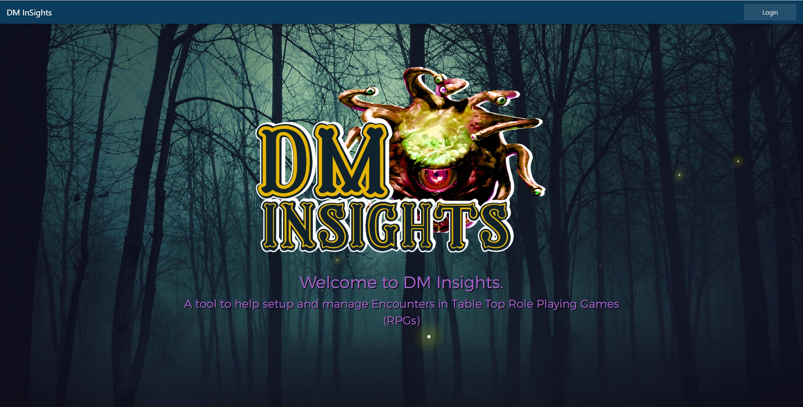
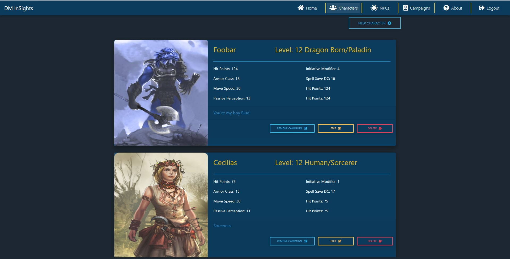
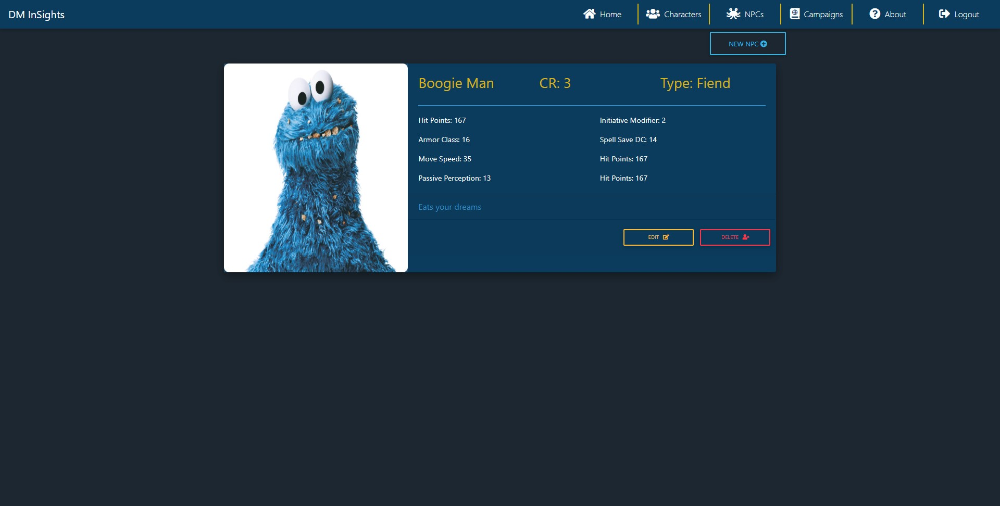
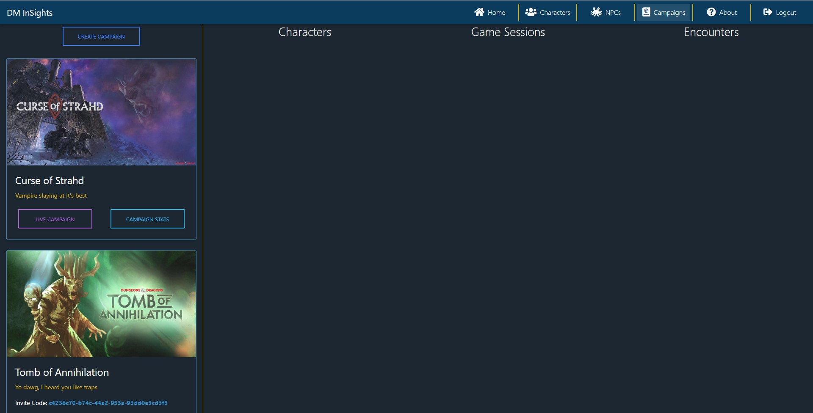
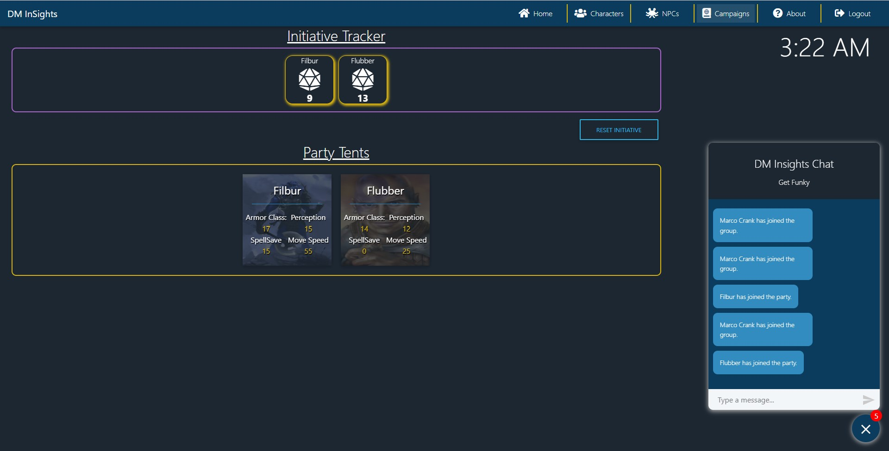
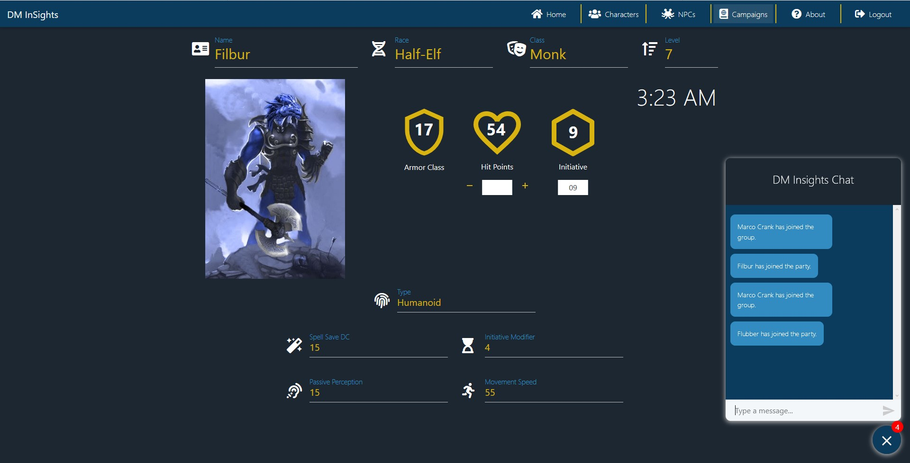

# DM Insights

This is my end of course capstone project. It is designed to test my skills learned over the last 12-months of evening classes completed at the Nashville Software School.

This is a web app built with `ReactJS`, `ASP.Net Core 3.0(Preview)`, `MDBReact`, `SignalR`, and `Okta` for OIDC/OAuth. DM Insights is an app to help facilitate the management of combat scenarios in a tabletop role playing game such as Dungeons and Dragons. It allows players and dungeon masters to manage their Characters, Non-Player Characters, and Campaigns.

Players can join their characters to campaigns once provided an invite code from the owner of a campaign. This provides the Dungeon Master a view to better manage combat encounters by tracking initiative and providing basic player stats.

Players can also leverage the built-in chat to send messages to each other and in the future whisper each other privately.

## Requirements

- Use our skills we have learned over the course of the past 12-Months to build an app using the following guidelines
- Use C#, .Net Core, and `ASP.Net Core` to build a back-end API
- Use SQL Server as a repository for Application Data
- Use ReactJS or other JavaScript Framework to provide a front end to our API

## Screenshots

Here are some screenshots of the application

#### Home Page

#### Characters Page

#### Non-Player Characters Page

#### Campaigns Page

#### Dungeon Master Screen

#### Player Character Screen

## How to run this project

### Requirements

- NodeJS for NPM
- .Net Core SDK 3.0 Preview 7
- Okta Developer Account - (https://developer.okta.com/)
- Visual Studio 2019 Preview (required to run .net 3.0 Preview)
- SQL Server 2017 Developer Edition

### Start Project

- Clone the repo
- Login to the Okta Developer Portal
  - Create an application inside Okta using the Single Page App option and change the Base and Login URIs to port 3000
  - Use the `/src/helpers/apiKeys.js.example` enter your oktaConfig information and rename to `apiKeys.js`
- Run the `DMInsights_Seed.sql` script in SQL to create the DB
- Open a terminal and change to the `client` directory and run `npm install`
- Open Visual Studio and open the `DMInsights.sln` file in the `server` directory start the project.
- In your terminal type `npm start` to fire up the front end code
- Enjoy
